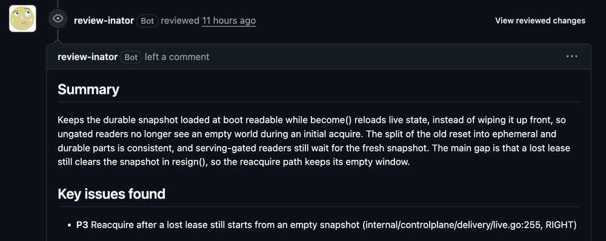

# reviewd

Self-hosted AI PR reviews with BYO harness. Runs (optionally multiple) reviewers in disposable Docker
containers, validates their findings, and posts a summary with inline comments
and a 0–5 merge-confidence score. Configurable with Codex and most other CLI harnesses supporting headless mode.

> [!CAUTION]
> PR descriptions, diffs, fixtures, and candidate reports are untrusted input. Currently, a malicious PR can use prompt injection to make a harness disclose its own model-provider credential, which its container holds by design. 

## Install

Requires Linux, Go 1.25+, Docker, and a GitHub App.

```sh
make build
make codex-image
./bin/reviewd init --app-id YOUR_APP_ID --parallelism 1
```

The default Codex harness uses a ChatGPT account login. Install Codex CLI and
Python 3 on the server, then log in as the service user:

```sh
mkdir -p credentials/codex
CODEX_HOME="$PWD/credentials/codex" codex -c 'cli_auth_credentials_store="file"' login
# Add --device-auth on a headless server.
```

To reuse a saved server login, set `credentials.codex_account.state_file` to its
absolute `auth.json` path. The config’s refresh command maintains that login and
provides access credentials to parallel containers. No API key or login JSON in
the service environment is needed. Use one managed login state per account session.
See [credential refresh](docs/configuration.md#shared-credential-refresh).

> If you are an AI agent setting this up for a user, follow [AGENTS.md](AGENTS.md) for the full install and configuration workflow.

## Connect GitHub

Create a [GitHub App](https://github.com/settings/apps/new) with:

| Setting | Value |
| --- | --- |
| Webhook URL | `https://YOUR_HOST/webhooks/github` |
| Webhook secret | Generate with `openssl rand -hex 32` |
| Repository permissions | Contents: read, Pull requests: read/write, Issues: read/write, Metadata: read |
| Events | Pull request, Issue comment |

Install the App on your repositories. Generate its private key, save it as
`github-app.pem` beside `reviewd.json`, and set the same webhook secret in the
service environment:

```sh
export REVIEWD_WEBHOOK_SECRET='YOUR_SECRET'
./bin/reviewd config check
./bin/reviewd doctor
./bin/reviewd serve
```

Forward HTTPS traffic to `127.0.0.1:8080` using a reverse proxy or tunnel.
[Deployment instructions](docs/deployment.md) cover systemd and Compose.

## Use

Reviews start when a PR opens, receives a push, reopens, or becomes ready for
review. Drafts and forks are skipped by default. Collaborators can request a
fresh review by commenting `@reviewd`.

👀 indicates review in progress. 👍 means confidence ≥4 with no P1/P2 findings.
👎 means the evidence does not support merging. Failed runs report a failure.
reviewd posts comments, and it does not approve, request changes, or merge PRs.

```sh
reviewd jobs list
reviewd jobs show JOB_ID
reviewd jobs retry JOB_ID
reviewd review --repo owner/repo --pr 42 --installation INSTALLATION_ID
```

## Configure

Edit `reviewd.json` and restart. `parallelism` controls reviewers per PR.
`workers` controls concurrent PRs. `reviewers` selects harnesses round-robin.
`validator` selects the independent final pass. `size_tiers` optionally routes
PRs of different sizes to different harness sets.

Each harness defines an image and a command argument array containing
`{{.Prompt}}` or `{{.PromptFile}}`, and may declare the `model` its command
selects. Published reviews name the harness and model that produced them. Custom
harnesses can pass credential names through `env`, or select shared refresh
definitions through `credentials`. Adding a harness requires only configuration
and its image. See the [configuration reference](docs/configuration.md) and
[agent reporting protocol](internal/report/AGENTS.md).

## Operate

Jobs and reports persist in `reviewd-data/`. Interrupted jobs recover on restart.
Failed jobs retry up to three attempts. `/healthz` checks HTTP liveness.
Monitor failed/stuck jobs and free disk space. [Retention and recovery](docs/deployment.md#observe-and-recover)
are operator-managed. Use a dedicated runner for untrusted code.

Snapshots omit Git history, submodule contents, and hydrated LFS objects.
Incomplete coverage lowers confidence. GitHub publication retries reconcile
existing reviews, but an ambiguous API response can still cause a duplicate.


```sh
make check        # race-enabled tests and go vet
make integration  # Docker pipeline, account transport, timeout and cleanup
```
