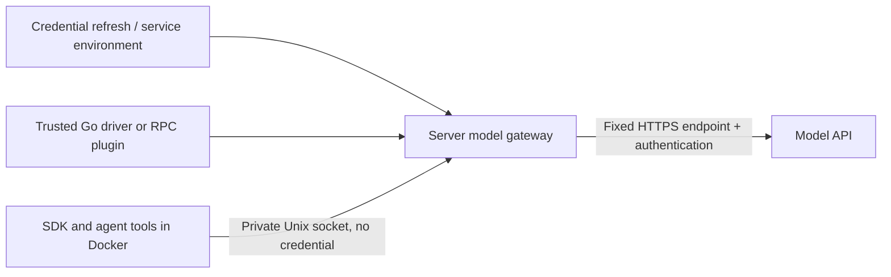

# Harness providers and plugins

A **harness** runs a reviewer or validator. Choose an official provider to use
its SDK with credentials kept outside the container, or define a custom
image/command harness when you need complete control of execution.

## Official providers

These are independent Go packages maintained by reviewd. “Official” describes
reviewd's adapters; it does not imply endorsement by the upstream vendors.

| Driver package | SDK | Server credential input | Image build |
| --- | --- | --- | --- |
| `github.com/jklq/reviewd/harness/codex` | `@openai/codex-sdk` | `CODEX_AUTH_JSON` **or** `OPENAI_API_KEY` | `make codex-image` |
| `github.com/jklq/reviewd/harness/claudecode` | `@anthropic-ai/claude-agent-sdk` | `ANTHROPIC_API_KEY` | `make claudecode-image` |
| `github.com/jklq/reviewd/harness/muse` | `@muse-code/sdk` | `MUSE_AUTH_JSON` **or** `META_API_KEY` | `make muse-image MUSE_BINARY=/path/to/versioned/muse-bin` |
| `github.com/jklq/reviewd/harness/opencode` | `@opencode-ai/sdk` | `OPENCODE_AUTH_JSON` **or** `OPENCODE_API_KEY` | `make opencode-image` |

All four adapters use the upstream SDK, including its completion/error handling.
Some SDKs launch the vendor's CLI or session server internally; reviewd does not
parse human CLI output to determine success. A successful SDK turn must also
submit a valid review through `reviewd agent submit`.

Images pin SDK versions. Muse requires an already installed **versioned binary**,
not its auto-update shell launcher; the SDK integration was checked with
Muse `1.3.0-R3057.1`. The image build copies only that executable, never a login.
Recheck runtime contracts when upgrading SDKs or binaries.

OpenCode routes OpenAI-compatible chat-completion models to fixed OpenCode Zen
endpoints. A bare model ID or `opencode/` prefix selects the pay-as-you-go API;
`opencode-go/` selects the Go subscription endpoint. Other OpenCode backends
need a driver with the appropriate fixed endpoint and protocol. Codex, Muse and
OpenCode accept their CLI's account login through a projected `*_AUTH_JSON`
value, alongside static API keys; Claude Code takes an API key only. Unsupported
credential modes fail; they never fall back to exporting secrets.

Only Codex has a login with a rotation lifecycle, so only Codex ships a refresh
helper (`reviewd-credential-codex`). Muse, OpenCode and other projected logins
use `reviewd-credential-project`, which exports the CLI's JSON login state
without network access; changing the state file invalidates the credential
cache, and an expired session requires signing in again with the provider CLI.
A provider that gains a rotating login should ship its own helper executable
implementing the same
[refresh contract](configuration.md#shared-credential-refresh), keeping its
rotation logic out of the reviewd binary.

### Configuration

Each provider requires `driver`, `image`, `model`, and `network`. `command` is
mutually exclusive with `driver`. Optional `reasoning_effort` is validated by the
driver: Codex and Muse accept their effort names, Claude Code takes its effort
levels, and OpenCode sends the value as the model's provider reasoning effort.
Optional `service_tier` is accepted by the Codex driver only and selects a tier
such as `fast` (sent as `priority` at request time) or another tier ID from the
model catalog.

For example, replace the `harnesses` map and reviewer/validator selection with:

```json
{
  "harnesses": {
    "claude": {
      "driver": "github.com/jklq/reviewd/harness/claudecode",
      "image": "reviewd-claudecode:local",
      "model": "claude-sonnet-4-6",
      "network": "none",
      "env": ["ANTHROPIC_API_KEY"]
    }
  },
  "reviewers": ["claude"],
  "validator": "claude"
}
```

`env` names service environment variables. For providers, their values are inputs
only to the trusted server-side driver. Use `credentials` instead of, or alongside,
`env` to select [shared refresh definitions](configuration.md#shared-credential-refresh).
Duplicate names are rejected. The provider receives the resulting access values;
refresh commands retain responsibility for rotation and durable login state.

To sign in instead of using an API key, point `state_file` at the provider CLI's
login file and project it with `reviewd-credential-project`. It reads the file,
requires JSON, and exports it verbatim as the named value; the driver uses only
the access credential it needs, and no login state enters the container. Use the
helper's absolute path when it is not on the service `PATH`.

```json
{
  "credentials": {
    "muse_account": {
      "state_file": "/var/lib/reviewd/credentials/muse/auth.json",
      "command": ["reviewd-credential-project", "MUSE_AUTH_JSON"],
      "exports": ["MUSE_AUTH_JSON"]
    },
    "opencode_account": {
      "state_file": "/var/lib/reviewd/credentials/opencode/auth.json",
      "command": ["reviewd-credential-project", "OPENCODE_AUTH_JSON"],
      "exports": ["OPENCODE_AUTH_JSON"]
    }
  },
  "harnesses": {
    "muse": {
      "driver": "github.com/jklq/reviewd/harness/muse",
      "image": "reviewd-muse:local",
      "model": "muse-spark-1.3",
      "reasoning_effort": "max",
      "network": "bridge",
      "credentials": ["muse_account"]
    },
    "opencode_go": {
      "driver": "github.com/jklq/reviewd/harness/opencode",
      "image": "reviewd-opencode:local",
      "model": "opencode-go/deepseek-v4.1-flash",
      "network": "bridge",
      "credentials": ["opencode_account"]
    }
  },
  "reviewers": ["muse", "opencode_go"],
  "validator": "muse"
}
```

For Muse select `github.com/jklq/reviewd/harness/muse`, `reviewd-muse:local`, and a Muse model ID.
For OpenCode select `github.com/jklq/reviewd/harness/opencode` and `reviewd-opencode:local`; prefix
the model with `opencode-go/` for the Go subscription. Key mode uses
`env: ["META_API_KEY"]` or `env: ["OPENCODE_API_KEY"]`; the state files above are the CLI's
`auth.json` for `muse login` and `opencode auth login`. Muse login mode uses the account key
`muse login` writes to `providers.meta.api_key`; OpenCode login entries must be API-key
logins (`type: "api"`), and OAuth entries are rejected. Neither login rotates server-side, so
signing in again is an operator action when a session expires.

The generated default uses the Codex provider and the existing `codex_account`
refresh definition, whose command is the shipped `reviewd-credential-codex`
helper built beside reviewd by `make build`. Existing configurations are not rewritten. To migrate an
existing Codex custom harness, rebuild its image, remove `command`, add
`driver: "github.com/jklq/reviewd/harness/codex"` and optionally `reasoning_effort`
and `service_tier`, and keep its
model and shared credential reference. Run `config check`, then `doctor` under
the service environment, and restart after installing the tested binary.

## Credential boundary



For official providers, neither access nor refresh credentials enter the SDK
container's environment, arguments, home, prompt, snapshots or logs. The driver
prepares public SDK settings and a separate server-only routing table. The model
gateway holds authentication and forwards only permitted methods, exact paths,
and known SDK query parameters to fixed HTTPS destinations. It strips incoming
authentication and forwarding headers, refuses redirects, hides upstream error
bodies and response headers, and bounds requests. Successful model JSON/SSE
payloads are streamed back to the SDK.

Each run mounts only its own socket directory, read-only. There is no public
listener or reusable bearer token for the gateway. The container's local relay
has no secrets. Removing the container and closing the gateway revokes access.
Provider requests work even with Docker `network: "none"`.

This makes **credential disclosure through prompt injection** unavailable to the
harness: the credential is outside its security boundary. It can still make
permitted model calls during its run, spend model quota, read review inputs,
execute sandboxed tools, and produce malicious review text. Network-enabled
containers can transmit repository content. Trusted drivers, plugin executables,
images, model endpoints, the service host, and Docker isolation remain part of
the trust boundary. This is not a claim that an entire review is prompt-injection
proof or that Docker prevents host/kernel exploits.

Custom `command` harnesses keep the original behavior: selected `env` values and
credential exports enter the container. They do not receive the provider guarantee.
Protect their credentials accordingly.

## Independent Go drivers

The public [`harness`](../harness/driver.go) package defines `Driver`, `Options`,
`Launch`, `Route`, `Register`, and `Lookup`. Like `database/sql`, a package's
`init` registers its import path. The shipped binary links the four official
packages. Package paths are identifiers, not URLs to download or execute.

A driver validates operator options and prepares an SDK launch. `Launch.Script`
and `Launch.Environment` are public container inputs; only `Route.Headers`
may contain credentials. Route destinations must be fixed HTTPS model endpoints.
Drivers must be safe for concurrent calls and must never include credentials in
errors. Keep login refresh in the existing credential command contract.

### Executable plugins with HashiCorp go-plugin

An additional driver can run as an independently built executable using
[HashiCorp go-plugin](https://github.com/hashicorp/go-plugin). The public
[`harness/plugin`](../harness/plugin/plugin.go) package supplies the version-1
net/rpc protocol, handshake, automatic mutual TLS, and process lifecycle.

A plugin's entire entry point can be:

```go
package main

import (
    "github.com/jklq/reviewd/harness/plugin"
    "example.com/acme/review-driver"
)

func main() {
    plugin.Serve("example.com/acme/review-driver", reviewdriver.Driver{})
}
```

Here `reviewdriver` is the imported package's declared name. Its `Driver`
implements `harness.Driver`. Build an ordinary executable with `go build` and
install it at an operator-controlled path. No `-buildmode=plugin`, shared object,
CGO, or exact Go toolchain match is needed; both sides must support protocol v1.

```json
"acme": {
  "driver": "example.com/acme/review-driver",
  "plugin": "/opt/reviewd/drivers/acme",
  "image": "acme-sdk:1",
  "model": "acme-model",
  "network": "none",
  "env": ["ACME_API_KEY"]
}
```

`plugin` is an executable path, resolved relative to the configuration file when
not absolute. `config check` starts configured plugins and validates their driver
and options. reviewd reuses each executable/driver pair, limits RPC preparation
to ten seconds, and terminates plugin processes on exit. A failed plugin fails
the review; no custom-harness fallback is attempted. Restart after plugin updates.
Plugins do not inherit the service environment; selected credentials cross the
RPC boundary only for preparation. Plugin stdout/stderr are discarded.

Plugins are **trusted server code**, not agent tools. They receive provider
credentials and can access the host as the service user. Inspect third-party
implementations before installing them; the official-provider guarantee does not
certify arbitrary plugins merely because they implement the interface. Keep plugin
executables and their directories outside repositories and review workspaces.

`make drivers` builds standalone executables for all four official packages;
each provider owns its executables under `harness/PROVIDER/cmd/`.
For example, add `plugin: "/opt/reviewd/drivers/reviewd-driver-codex"` to a Codex
provider entry to use its executable instead of the linked implementation.

## Upstream references

- [Codex SDK](https://developers.openai.com/codex/sdk/)
- [Claude Agent SDK credential isolation](https://code.claude.com/docs/en/agent-sdk/secure-deployment)
- [Muse Code SDK](https://github.com/meta-models/muse-code-sdk)
- [OpenCode SDK](https://opencode.ai/docs/sdk/)
